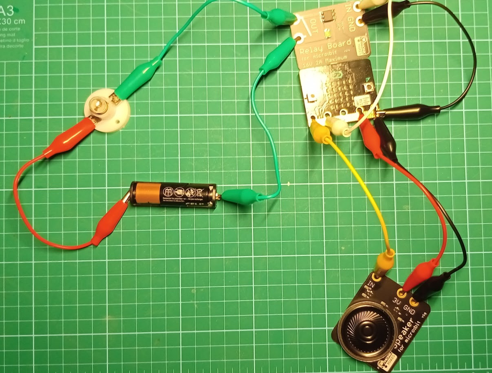

## Haciendo ruído

Vamos a hacer música, usando los bloques de la paleta "Música". 
La placa micro:bit incluye muchos sensores, vamos a usar uno de ellos, el acelerómetro, que detecta cuando la movemos.

Vamos a arrastrar desde la paleta "Entrada" el bloque "si agitado" y dentro el bloque "play melody" desde la paleta "Música"

[Música](https://makecode.microbit.org/_Rsfe6X6vMED1)

Vemos que el simulador nos indica que hace falta conectar unos cascos/altavoces. Si acercamos el ratón al simulador veremos que se mueve la placa ¡Podemos simular que la agitamos! Es un simulador muy completo.
El simulador sonará al mover el ratón sobre la placa.

Ahora descargamos el programa como antes. Si tenemos una micro:bit v2 sonará al agitarla.

La versión 1 de la placa micro:bit no tiene altavoz y no sonará nuestro programa, por ello vamos a conectar un altavoz. Usaremos el [Kit de Iniciación a la electrónica de MonkMakes](http://www.monkmakes.com/mb_kit_es)

Usaremos 3 cables de pinzas cocodrilo para conectar el altavoz/Speaker y la micro:bit. Podemos usar cables de cualquier color, pero es mejor seguir un esquema, conectando:

micro:bit| Speaker | cable
---|---|---
GND | GND |cable negro
3V| 3V | cable rojo
0|IN| cable amarillo

Veremos cómo suena:

[Vídeo: Reproduciendo música al agitar micro:bit](https://youtu.be/VwGuElgN2t8)

## Controlando corrientes y potencia externa: interruptor electrónico

Vamos a empezar haciendo un sencillo circuito eléctrico con la bombilla, la pila y algunos cables:

Al conectarlo se encenderá la bombilla.

Ahora vamos a hacer un sencillo interruptor hecho con cables. Sustituiremos el cable verde por 2 cables verdes. 

Cuando juntemos los cables verdes se cerrará el circuito y se encenderá la bombilla.

Ahora vamos a insertar interruptor electrónico, un **Relé/Relay** que podremos controlar desde la programación de la micro:bit.
Conectaremos los 2 cables verdes en la salidas **OUT** de la placa del relé. No importa cuál pongamos en cada una:

El relé nos permite controlar más potencia que lo que puede hacer la micro:bit directamente.

Usaremos 2 cables para conectar el Relé a la micro:bit

micro:bit| Relay| cable
---|---|---
GND | GND |cable negro
1| IN | cable blanco

Vamos a hacer un programa para encender y apagar con los botones A y B. 

* Cuando pulsemos el botón A encenderemos la salida P1 de la micro:bit
* Cuando pulsemos el botón B apagaremos la salida P1 de la micro:bit

Usaremos el bloque "Al pulsar el botón A" de la paleta "Entrada" y "escritura digital pin P1" desde la paleta "Pines" de "Avanzados". Seleccionamos "P1" y ponemos "1" para encender y "0" para apagar:

[Música + Luz](https://makecode.microbit.org/_9cCRiFb7C2ys)

* Descargamos el programa a la placa
* Pulsamos el botón A y se encenderá la bombilla
* Pulsamos el botón B y se apagará

Si queremos controlar un motor/ventilador en lugar de la bombilla, sólo tenemos que sustituir la bombilla por el motor. Al cambiarlo tendremos un ventilador controlado desde un micro:bit.

Podemos invertir el sentido de giro del ventilador, cambiando entre sí los cables del motor.

## Termostato

Otro de los sensores que incluye la micro:bit es el sensor de temperatura, situado en la parte de atrás:

Podemos encontrar el valor de la temperatura de la placa en la paleta "Entrada".

Un termostato es un aparato que hace algo cuando la temperatura es mayor que un valor y otra cosa cuando sea menor.

Para ello vamos a usar  el bloque "Si ... entonces si no" y el bloque hexagonal "operador  >" ambos de la paleta "Lógica" 

* Ponemos el bloque "Si ... entonces si no" dentro del bloque "para siempre" porque necesitamos que se esté revisando siempre esta condición
* Añadimos el bloque hexagonal "operador >"  en la parte de la condición
* En un lado del operador ponemos el valor de la temperatura, de la paleta "Entrada"
* Ponemos en el otro lado el valor de la temperatura que usaremos, por ejemplo 25.
* En caso de que la temperatura sea mayor encenderemos el ventilador con el bloque "escritura digital pin P1" a 1
* En "si no " apagaremos el ventilador con el bloque "escritura digital pin P1" a 0

[Proyecto: Música, Ventilador y termostato](https://makecode.microbit.org/_DzJHtaPoT4dT)

Para probarlo:

* Descargamos el programa
* Tocamos el sensor de temperatura para calentarlo
* Se encenderá el ventilador
* Apuntamos el ventilador hacia el sensor, para enfriarlo
* El ventilador se apaga

[Vídeo: Ventilador controlado con termostato usando micro:bit](https://youtu.be/9PxjRF-k8-g)

