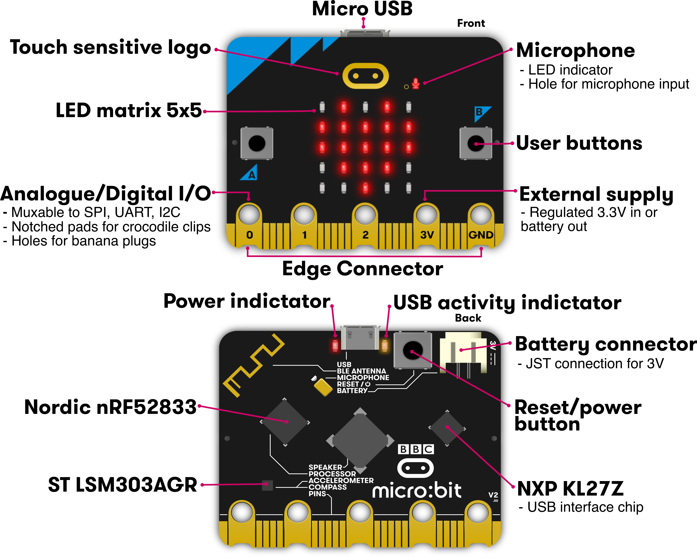

# 0. ¿Qué es un robot? 

Duración 20-30 minutos

Dinámica. Trabajo en grupo. Preguntas en alto para responder

* ¿Conoces algún robot?
* ¿Dónde lo has visto?
* ¿Tienes alguno en casa?

A quien responda
* ¿Qué hace?
* ¿Qué partes tienes?

### Tips
* Distinguir Robot de autómata o de herramienta
* Aprovechar las descripciones que hacen para ir dando conceptos
* Se puede hablar de:
    * Robot de limpieza: 2 ruedas/motores, sensores de choque, de paredes, detectores de suelo, motor del aspirador ¿Saben buscar su casita?
    * Robot de cocina: diferenciar de las "herramientas eléctricas de cocina". Motor/batidora, báscula, calentador,...
    * Parking automático: barreras, cámaras lectoras de matrícula, sensores de ocupación, pantallas, cajeros, sensores de humos, ventilación... 
    * ¿Un coche es un robot? ¿y uno que conduce él solo? (Ejemplos de Tesla)
    
### Conceptos a buscar
* Sensores: tipos y lo que miden
* Actuadores: motores + mecánica
* Cerebro: tipo de placas de control. Comparación de capacidades entre Arduino y un móvil
* Alimentación: baterías, paneles solares,...

# Definición de robot:

"Máquina automática programable capaz de realizar determinadas operaciones de manera autónoma y sustituir a los seres humanos en algunas tareas, en especial las pesadas, repetitivas o peligrosas; puede estar dotada de sensores, que le permiten adaptarse a nuevas situaciones”

# ¿Qué es microbit? Correspondencia con el robot

## ¿Qué es [micro:bit](http://microbit.org)?

micro:bit es un pequeño micro-ordenador programable, diseñado para hacer fáciles y divertidos la enseñanza y aprendizaje de temática #STEAM.

Nos permite trabajar la computación física, haciendo  "tocable"  el pensamiento computacional de una forma sencilla.

Beneficiada de la experiencia de otros muchos sistemas similares anteriores (como Arduino o Raspberry pi) incluye en una pequeña tarjeta una gran cantidad de sensores, leds y botones, permitiéndonos hacer una gran cantidad de proyectos distintos usando sólamente la tarjeta micro:bit

Esta es una breve descripción de su hardware:

1. Botón A y Botón B
1. 5x5 leds rojos
1. Conectores para pinza de cocodrilo P0, P1, P2 (GPIO)
1. Conector 3V (Voltaje)
1. Conector GND (Tierra)

1. Antena de radio y bluetooth
1. Procesador y sensor de temperatura
1. Brújula
1. Acelerómetro
1. Pines (GPIO)
1. Conector microUSB (alimentación y carga de programas)
1. Led de alimentación y/o programación
1. Botón reset
1. Conector de alimentación (2 x pilas 1.5V)
1. Chip USB

### Para saber más detalles v2

[Hardware](https://tech.microbit.org/hardware/)

(Tomado de [Overview de microbit.org](https://microbit.org/get-started/user-guide/overview/))

# 1. Emulador: caritas, botones y textos

Vamos iniciarnos en la programación con bloques de micro:bit

Podemos programarla usando bloques con el editor **[MakeCode](https://makecode.microbit.org)**

o **[Scratch](https://scratch.mit.edu/microbit)** con la extensión micro:bit

O con lenguajes de programación como **[Python](https://python.microbit.org/v/2)**, Javascript,  e incluso con el C++ de Arduino. Estos son entornos mas avanzados.

Trabajar con Scratch permite mezclar parte de la funcionalidad de nuestra micro:bit (botones, leds, acelerómetro y conexión a los pines 0,1 y 2) con el resto de posibilidades de Scratch: personajes, sonidos, dibujar en pantalla, vídeo, música,... usándola como un mando remoto de nuestro ordenador. Perdemos algunas de las características de micro:bit como la brújula y el sensor de temperatura pero ganamos en interacción.

Para usar toda la funcionalidad de micro:bit debemos usar el editor de bloques de MakeCode o Python. Podemos usar tanto ordenadores como tablets.

Nosotros programaremos nuestra micro:bit con bloques usando el editor de  [Makecode](https://makecode.microbit.org)

## IDE/Entorno de programación

1. Paletas con los bloques de programación. Las paletas tienen un color determinado, igual que los bloques que contienen.
2. Tapete/Lienzo: donde arrastramos los bloques de nuestro programa
3. Simulador: va ejecutando el programa que hemos hecho
4. Botón deshacer
5. Botones de Zoom para ampliar/achicar
6. Configuración. Podemos seleccionar el idioma
7. Nombre de nuestro programa

Si no te aparece en tu idioma, puedes cambiarlo pulsando el icono del engranaje arriba a la derecha y seleccionar el idioma que prefieras

## Reto: Mostrar iconos con los 5x5 leds

Hemos visto que nuestra micro:bit tiene 25 leds (5x5) en la parte delantera. Vamos a mostrar iconos.

Arrastraremos 2 bloques "Mostrar icono" desde la paleta Básico (1) al Tapete (2)

[Proyecto: iconos](https://makecode.microbit.org/_E3Pe8zJRaXVg)

Damos nombre a nuestro programa "Emoticono" escribiéndolo en la caja del nombre (7)

Veremos como se muestran los iconos en el Simulador (3), una excelente características del entorno, que nos permite aprender a programar y usar la micro:bit antes de tener un dispositivo físico.

## Reto: mostrar iconos distintos según el botón que pulsemos

Ahora vamos a hacer que al pulsar cada uno de los botones de la micro:bit se muestre un icono distinto. Como tiene 2 botones (Botón A y Botón B) podemos detectar cuando se pulsen por separado o los dos juntos. Cuando los pulsemos la micro:bit nos avisará por medio de un **Evento**, nosotros decidiremos qué hacer cuando se produzca.

Dentro de la paleta **Entrada** tenemos muchos bloques correspondientes a eventos, entre ellos el correspondiente a **Evento Presionar Botón X** que tiene un desplegable para seleccionar Botón A, B o A+B.

Vemos que este tipo de bloques está pensado para que incluyamos dentro otros bloques, que se ejecutarán como respuesta al evento correspondiente.

Pondremos un bloque para cada uno de los eventos de botones: 
* A y B mostrarán iconos distintos
* A+B borrará la pantalla

**Ayuda**: si te aparece uno de los bloques de eventos de color gris es porque ya has seleccionado ese mismo evento/botón. Cámbialo y se mostrará azul.

Puedes eliminar los bloques "al iniciar" y "para siempre" puesto que no los vamos a usar (y siempre podemos encontrarlos en la paleta **Básico**). Para ello arrástralos sobre la paleta de bloques.

[Proyecto botones+iconos](https://makecode.microbit.org/_eCVCkK9bPCDL)

Para probralo, pulsa los botones del simulador en la pantalla (¡No las teclas A y B de tu teclado!) y comprueba que funciona bien.

## Reto: crea tus propios iconos/dibujos

Usa el bloque de dibujo libre para crear tus propios dibujos/iconos

# 2. micro:bit: Caritas, botones y dado

Vamos a comenzar a usar nuestra micro:bit, para ello vamos a descargar los programas que ya hemos hecho (y que volveremos a ver al abrir la página web de Makecode) a la placa. 

Necesitaremos:
* Placa micro:bit
* Cable USB, de tipo micro-usb
* Portapilas y 2 pilas AAA (para usar la micro:bit sin el PC)

Pasar el programa es muy sencillo puesto que la micro:bit aparece como un USB pendrive al conectarla al PC.

El procedimiento para pasar nuestro programa a la micro:bit es el siguiente:

1. Conectamos la micro:bit por USB (con un cable micro-USB). 
1. Veremos que en el ordenador nos aparece conectado un disco USB llamado "Microbit"
1. Descargamos el programa pulsando el botón "Descargar" de la página web

1. Copiamos el fichero a la unidad llamada Microbit. Tarda unos segundos mientras los que parpadea una luz amarilla/ambar que hay en la parte de atrás de la micro:bit. **Hay que esperar hasta que deje de parpadear**.

En un ordenador con Windows:

En un ordenador con Linux/Guadalinex, al pulsar Descargar:

Seleccionamos "Guardar archivo"

Al conectar la micro:bit nos aparecerá una nueva unidad llamada "MICROBIT"

Pulsamos en Lugares

Seleccionamos Descargas

Copiamos el fichero descargado a la unidad "MICROBIT"

* Cuando instalamos un programa se borra el anterior
* El último programa instalado no se pierde al quitarle la alimentación a la placa.

Para probar, pasaremos los 2 programas que hemos hecho anteriormente.

Podemos alimentar la micro:bit con el cable USB conectada al PC o bien conectándola a un USB-Powerbank. También podemos alimentarla con 2 pilas de 1.5V.

## Reto: Usar la microbit para indicar si nos hemos enterado de la explicación

* Pasamos el programa de "Botones e Iconos" 
* Conectamos las pilas para poder usar la micro:bit sin ordenador.
* Hacemos una pregunta y los alumnos con sus micro:bit nos contestan: ¿Os gusta usar las micro:bit?

## Problemas frecuentes

A veces nos encontramos con problemas para pasar el programa, porque nuestro PC no detecta a la micro:bit. Algunas de las posibles causas:

* Estamos usando un cable USB de alimentación no de datos. Solución: cambiar por otro cable USB.
* El cable USB está defectuoso. Solución: cambiarlo.
* El puerto USB no da suficiente potencia para alimentar la micro:bit. A veces ocurre con los puertos USB delanteros de los PCs. Solución: conectar a un USB trasero.

## Reto: Hacer un dado

Uno de los sensores que incluye la micro:bit es el acelerómetro que nos permite detectar cuando movemos nuestra placa.

Detectaremos movimiento usando el evento **Si agitado** que está, como todos los sensores, en la paleta

Ahora vamos a mostrar un número en la pantalla, para lo que usaremos el bloque **mostrar número** que está en la paleta **Básico**. Pero queremos que sea un número aleatorio, elegido al azar. ¿En qué paleta tendremos un bloque que nos permita hacer eso? Arriba de las paletas tienes una caja para buscar bloques por su nombre. Escribe "azar" y veras que salen varios bloques. 

Usaremos el bloque "escoger al azar de ..."

Donde podemos seleccionar el rango en el que se encontrará el número (en un dado normal es entre 1 y 6).

Al arrastrar el bloque veremos que se queda gris, además no es cuadrado, como los otros bloques, sino redondeado. Eso es porque es un **bloque de valor** y necesita de un bloque cuadrado donde se use su valor.

Para usaremos el bloque **mostrar número** que está en la paleta Básico

Pondremos el bloque de "elegir número..." en el hueco blanco de "mostrar número"

En el simulador podemos pulsar en la palabra **shake** para simular el movimiento.

Ahora ponemos el valor mínimo y máximo que saldrá en nuestro dado.

Vamos a mostrar al inciar el programa una ayuda al usuario, mostrando en pantalla unas instrucciones. Para ello usaremos el bloque "mostrar cadena" donde añadiremos el texto que queramos mostrar

[Programa dado](https://makecode.microbit.org/_erxD3veibFKp)

### Reto hacer un programa que nos de la nota de un examen

Vamos a cambiar los valores para sirva para calificar aleatoriamente un examen...

**Hack:** Truca tu programa para que siempre apruebes...

# 3. Más sensores de micro:bit : temperatura y luz

Sensor de luz

Sentencias condicionales

### Reto: ¿Hace calor?

### Reto: Luz de entrada automática

# 4. Robot: movimientos básicos

**CUIDADO con los movimientos que se pueden CAER**

### Reto: moviendo adelante y atrás

### Reto: girando

# 5. Robot: precisión en los movimientos. Dibujando cuadrados

### Reto: Repitiendo movimientos

### Reto: Moviendo 0.5m

### Reto: Giro de 90º

### Reto: Dibujando un cuadrado

## Puesta en común

Vamos a mostrar cómo nuestros robots hacen los cuadrados en el suelo

# 6. Robot: personalidad. Sensor siguelíneas (no te caigas) y de distancia (timido/cariñoso)

# 7. STEAM Kit

### Reto: Termostato

### Reto: Sistema de riego

# 8. Sensores y domótica

Reto

# 9. Comunicaciones - Radio

### Reto: Dado comunitario vía Radio

### Reto: Viendo la temperatura de fuera

### Reto:

