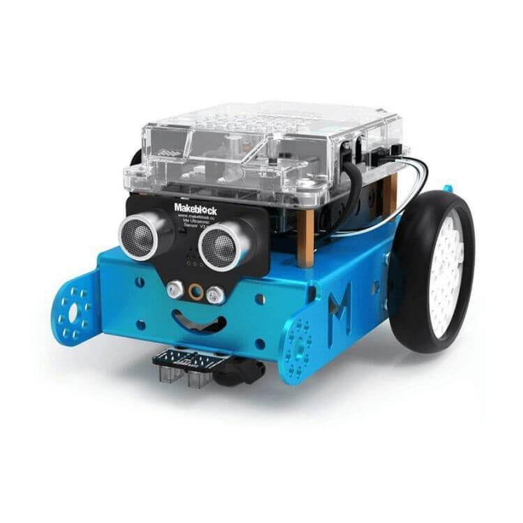
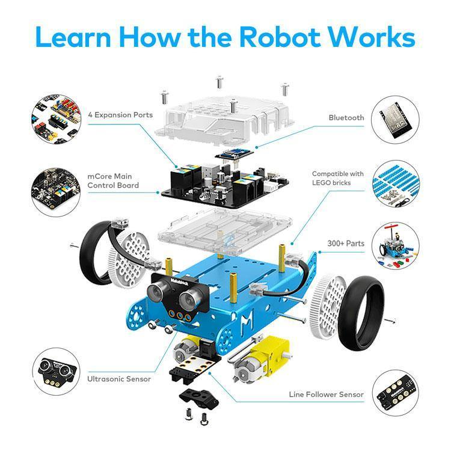
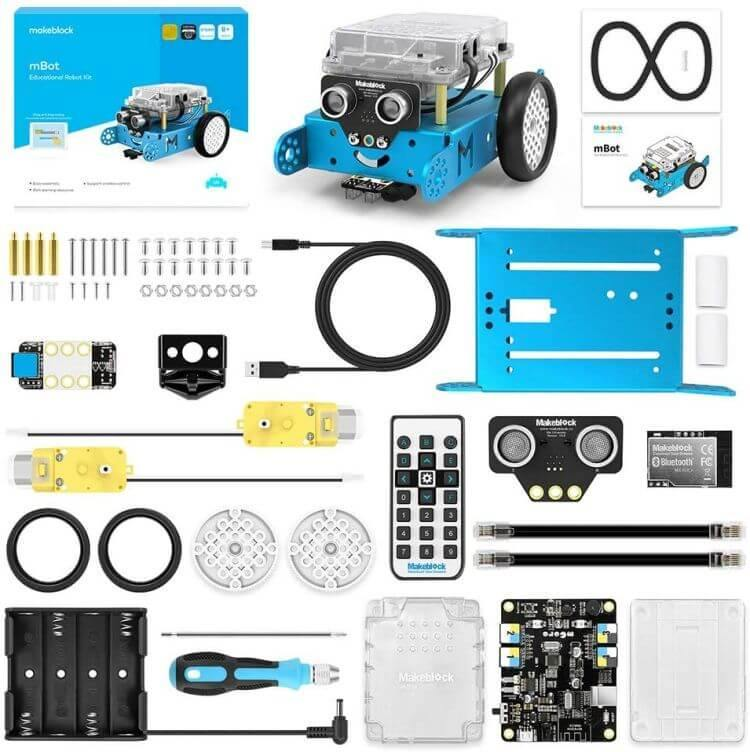
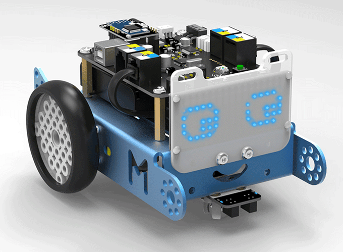
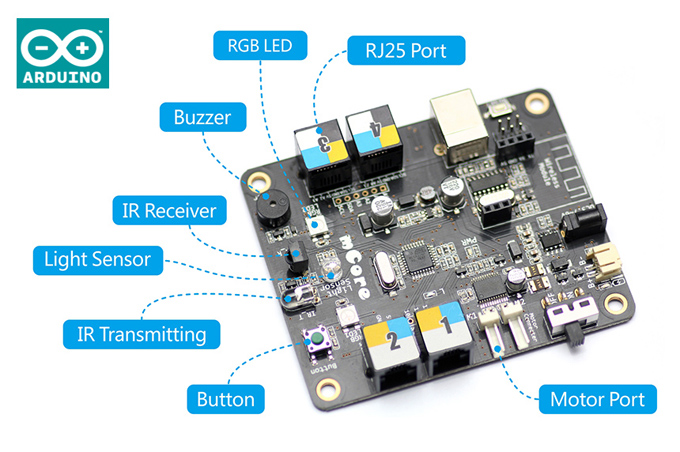

## Introducción a la programación y la robótica con mBot y makeBlock

mBot es un robot Open Source ([aquí](https://github.com/Makeblock-official/mBot/blob/master/pcb/mCore.pdf) puedes ver su diseño) pensado para aprender robótica, centrándonos sobre más en la programación y el uso y menos en el montaje y la construcción.

Su estructura de metal lo hace bastante robusto, permitiendo el montaje y desmontaje varias veces.

Si tenemos que buscar alguna pega es que su estructura hace que su uso casi se limite al del típico robot de suelo, dificultando la creación de otros tipos de robots.

Su electrónica está basada en la conocida placa Arduino, con la que es totalmente compatible.

Es un robot bastante completo, incluyendo varios sensores

Se monta con bastante facilidad en unos 40 minutos. El kit incluye todas las herramientas necesaris

Podemos programarlo con bloques usando su entorno makeBlock y también con código C++, usando su entorno o desde el propio IDE de Arduino.

#### Placa mBot

#### Sensores incluidos en la placa
* Sensor de luminosidad
* Emisor y receptor de infrarrojos (para usar el mando o comunicarte con otro mBot)
* Dos luces LED RGB para que las pongas del color que quieras
* Zumbador para emitir notas musicales
* Un pulsador programable

#### Módulos Externos incluidos
* Sensor de ultrasonidos
* Sensor sigue-líneas
* Módulo bluetooth de comunicación inalámbrica (para usarlo con el móvil o programarlo sin cables con Scratch)
* mBot 2.4G es el más recomendable si vas a utilizarlo en aulas, ya que se sincroniza automáticamente con el ordenador gracias a su mochila USB 2.4G (incluida)..." para que puedas programarlo remotamente con cada PC

