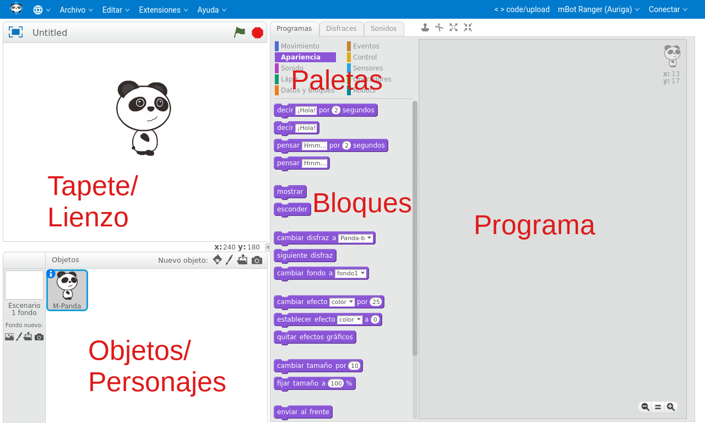
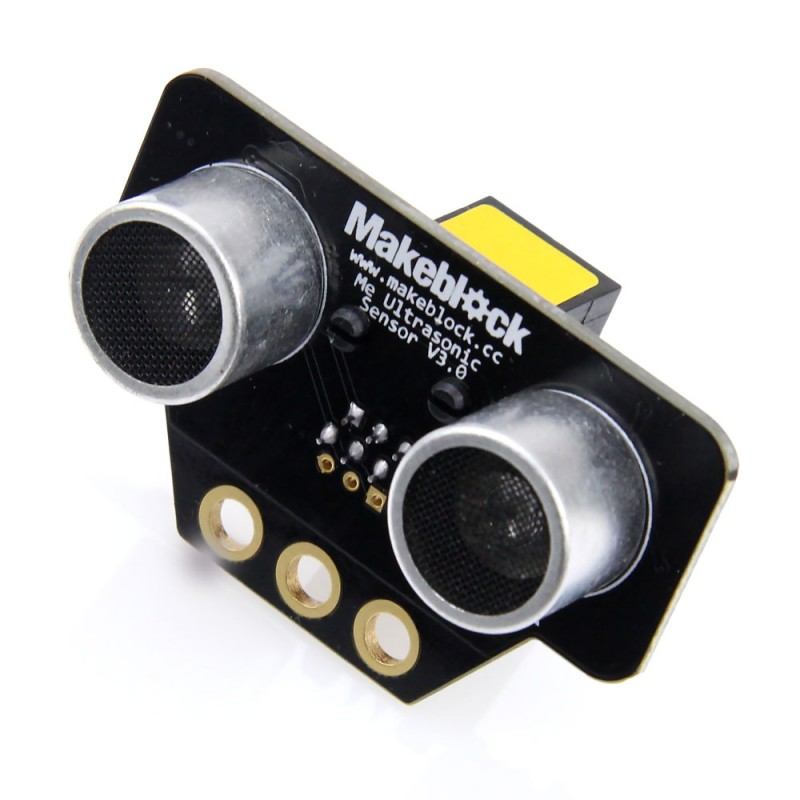
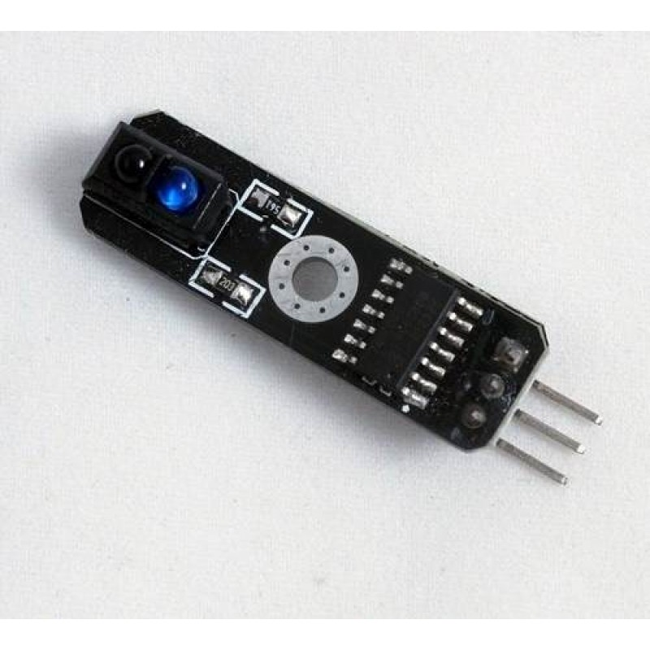

# Clases

## Requisitos

Se recomienda que tengo algo de conocimiento de Scratch. Al final tienes un rápido repaso.

## 0. Introducción a la robótica. ¿Qué es un robot? 

Duración 20-30 minutos

Dinámica. Trabajo en grupo. Preguntas en alto para responder

* ¿Conoces algún robot?
* ¿Dónde lo has visto?
* ¿Tienes alguno en casa?

A quien responda
* ¿Qué hace?
* ¿Qué partes tienes?


### Tips
* Distinguir Robot de autómata o de herramienta
* Aprovechar las descripciones que hacen para ir dando conceptos
* Se puede hablar de:
    * Robot de limpieza: 2 ruedas/motores, sensores de choque, de paredes, detectores de suelo, motor del aspirador ¿Saben buscar su casita?
    * Robot de cocina: diferenciar de las "herramientas eléctricas de cocina". Motor/batidora, báscula, calentador,...
    * Parking automático: barreras, cámaras lectoras de matrícula, sensores de ocupación, pantallas, cajeros, sensores de humos, ventilación... 
    * ¿Un coche es un robot? ¿y uno que conduce él solo? (Ejemplos de Tesla)
    
### Conceptos a buscar
* Sensores: tipos y lo que miden
* Actuadores: motores + mecánica
* Cerebro: tipo de placas de control. Comparación de capacidades entre Arduino y un móvil
* Alimentación: baterías, paneles solares,...


# Definición de robot:

"Máquina automática programable capaz de realizar determinadas operaciones de manera autónoma y sustituir a los seres humanos en algunas tareas, en especial las pesadas, repetitivas o peligrosas; puede estar dotada de sensores, que le permiten adaptarse a nuevas situaciones”

## 1. Montaje

### Reto: Montaje del robot.

Seguiremos las instrucciones de montaje del robot mBot

[Instructions](https://www.robotshop.com/media/files/pdf/mBot-instruction.pdf)

(Pueden hacerlo perfectamente sólos)

### Reto: Identificación de los componentes del robot

## 2. Entorno mBlock

Existen varias versiones del entono mBlock disponible:
* Versión 4: (disponible para Gualinfo)
* Versión 5: que se ejecuta desde el navegado y sólo require de la instalación de un complemento

Salvo la instalación el uso es prácticamente el mismo.

### Instalación

#### Versión v5

Accedemos al ide [https://ide.mblock.cc/#/](https://ide.mblock.cc/#/)

o [descargamos](https://mblock.makeblock.com/en-us/download/)

[Instalación](https://www.mblock.cc/doc/en/old/mlink-quick-start-guide.html)

En linux
```
sudo mblock-mlink start

```


### Uso de mBlock



Las paletas nos permiten seleccionar grupos de bloques, donde se guardan por afinidad

Moveremos los bloques a la parte del programa para ir creando este

Los bloques se ejecutan siempre de arriba a abajo (y han de colgar de un evento)

Si pulsamos en un bloque lo ejecutamos aunque no forme parte del programa

Si se realizan movimientos del objeto o dibujos esto se harán sobre el lienzo


### Funcionamiento

Tenemos 2 modos de funcionamiento:

#### Scratch/mBlock

Podemos usar todos los bloques disponibles con lo que nuestro programa se ejecuta en el pc (actuando sobre los objetos) y en el robot (con todas las acciones que realizamos sobre este)

Nuestro acciones que enviamos al robot se interpretan sobre un **firmware base** que tenemos que tener instalado en este

## Instalacion del Firmware

Ha de hacerse vía USB

* Conectamos el robot al PC
* Seleccionamos nuestro robot mBot Core


* Seleccionamos USB


* Pulsamos sobre "Update Firmware"

## 3. Uso de la pantalla, luces y sonido

## 4. Movimientos básicos

Podemos controlar el movimiento de los dos motores M1 y M2 con el siguiente bloque


Valores negativos hacen girar el motor en un sentido y los positivos en el otro. En valor absoluto podemos dar valores de 0 (parado) hasta 255 (máxima velocidad). En la práctica, para valores pequeños el motor no se mueve (el valor concreto depende del nivel de carga de las baterias)

Veamos como hacer un ejemplo sencillo de movimiento en una dirección


[ControlMotores.sb2](./Ejemplos/ControlMotores.sb2)

### Reto: Hacer que se muevan los dos motores en el mismo sentido

### Reto: Hacer un bucle que vaya desde la maxima velocidad en un sentido hasta la máxima en el otro

Dependiendo de la  geometría de robot y de la velocidad de cada motor, el movimiento resultante será uno u otro


(Imagen de "juegos-robótica.es")


### Reto: hacer que el robot haga diferentes tipos de giros

* Haz que gire sobre una de sus ruedas, dejándola parada y moviendo la otra
* Ahora haz que el robot gire sobre su centro, moviendo los dos motores en ¿direcciones contrarias?
* ¿Cuál es más rápido? ¿cuál necesita más espacio?


### Reto: controlar el robot con el teclado

Vamos a hacer un sencillo programa para controlar los movimientos del robot con las teclas de las flechas del teclado del PC


[Interaccion Scratch/MakeBlock](../Ejemplos/ControlManual.sb2)


## 5. Movimientos Calibrados

Ya que hemos conseguido que nuestro robot se mueva, vamos a hacer que haga movimientos precisos, tanto en línea recto como en giros.

Para ello:
* Daremos una orden de movimiento al robot (velocidades para cada motor) 
* Esperaremos un cierto tiempo (es lo que tenemos que calibrar)
* Detenemos los motores.

Algo muy frecuente es que se piensa que si los motores se pararán solos, pasado un tiempo., y esto no es así: **Debemos de dar la orden de que se pare EXPLICITAMENTE**. De lo contrario seguirán con el movimiento que tenían.

### Reto: Realizar movimiento de giro de 90, 180 y 360 grados

* Medir el tiempo necesario para generar esos movimientos
* Comparar los tiempos con distintos robots


### Reto: Calibrar el movimiento en línea recta

Suele ocurrir  los motores no giran con igual velocidad, por ello para conseguir movimientos en línea recta es necesario ajustar las velocidas. 

* Ajustar el movimiento del robot a una línea recta de 1 metro.

### Reto: Realizar un circuito donde el robot haga el siguiente movimiento:
* Avance 1metro en línea recta
* Gire 180º
* Avance 1 metro en línea recta volviendo al punto de partida
* Gire 180º para terminar en la posición original


## 6. Sensores

## Sensor de distancia

Se trata de un sensor de ultrasonidos que nos permite medir la distancia a los obstáculos



El funcionamiento se basa en medir el tiempo que tarda en rebotar la onda ultrasónica que se emite


Obtendremos el valor de la distancia al obstáculo usando el bloque siguiente, donde indicaremos en que puerto lo hemos conectado


### Reto: Midiendo distancias

Vamos a mostrar en la pantalla del robot la distancia a la que está el objeto.
[MedidorDistancias](../Ejemplos/MedidorDistancias.sb2)


Podemos hacer un sencillo programa que muestre el valor de la distancia al obstáculo. Para ello crearemos una variable __distancia__ que mostraremos en pantalla


[ProgramaMedidaDistancia.sb2](../Ejemplos/ProgramaMedidaDistancia.sb2)

### Reto: estudio del comportamiento de los ultrasonidos  con diferentes tipos de objetos

* Dado que las ondas de ultrasonidos no rebotan igual en todos los objetos, se puede ver la diferencia entre usar un cartón, un metal o una tela (como una cortina)

* También se puede comprobar que la forma de los objetos influye, no es lo mismo el rebote que se produce en la cara de una caja de cartón que en una esquina de la misma

* El haz ultrasónico tiene forma cónica, es decir se va ensanchando a media que se aleja. Por eso la sensibilidad es diferente a distintas distancias. También ocurre que puede rebotar en el suelo si el sensor está muy bajo

* Comprobar como distintos robots usando ultrasonidos a la vez pueden engañarse (no distinguen si el haz que le llega es el suyo o el de otro) dando lugar a medidas erróneas

### Otros usos del sensor

Piensa otras utilidades del sensor de distancia:

* Altura de un ascensor
* Nivel de líquido en un depósito
* Sistema de alarma
* ...


### Reto: Sensor de aparcamiento

Vamos a hacer que nuestro robot produzca sonidos más rápidos o agudos a medida que un objeto se acerque

## Sensor Infrarrojo

Se trata de un sensor que es capaz de medir la cantidad de luz que se refleja en un objeto. Usa luz infrarroja que él mismo emite para evitar en la medida que se pueda la influencia de la luz ambiental





Podemos determinar su valor con el siguiente bloque


Veamos un sencillo programa para ver el estado del sensor


[SensorIR.sb2](../Ejemplos/SensorIR.sb2)

## Ejemplo: ver como influye el color de la superficie y la iluminación

Comprobar como diferentes superficies e iluminaciones influyen en el resultado

## Ejemplo: buscar proyectos donde puede user útil este sensores
* Contador de personas que pasan por una puerta
* Como final de carrera
* ¿Serviría con líquidos?

### Reto: No te caigas


### Reto: Midiendo la luz

## 7. Definiendo comportamientos/personalidades

### Reto: robot tímido

### Reto: robot curioso

### Reto: busca la luz

### Reto: maniobra de esquivar objeto

### Reto: siguelíneas

## 8. Kit STEAM

## 9. Otros robots/montajes

# Arquitectura robots

Dinámica en grupo (si hay pocos las hacemos todos juntos)

Vamos a trabajar la arquitectura de los robots que conocemos
Entregamos algunos componentes del kit para hagan un prototipo de sus robots
* Deben describir lo que hacen 
* Establecer la funcionalidad de su robot
* Ver los componentes disponibles y si necesitan algunos.


## 10. Control remoto

## Control remoto con mando IR

El mando es un mando normal (podemos usar cualquier mando, solo buscando los códigos)


El receptor IR


Usaremos el mando a distancia IR para controlar el robot y que siga lineas o salga de un laberinto

## Codigos mando

[Uso de mando IR](https://makeblock.es/foro/topic/57/utilizacion-mblok-con-receptor-infrarrojos/1#post-155)

    64 Up
    25 Down
    7 Left
    9 Right
    21 Setup
    69 A
    70 B
    71 C
    68 D
    67 E
    13 F
    22 0
    12 1
    24 2
    94 3
    8 4
    28 5
    90 6
    66 7
    82 8
    74 9


## 11. Programación Arduino

#### Modo Arduino

Dado que la placa base de nuestro robot está basada en Arduino, lo que hacemos es enviar un programa nativo a este, con lo que perdemos la posibilidad de ejecutar acciones sobre el PC. Muchos bloques no se pueden usar al activar el modo Arduino 


Vemos como muchas de las paletas se desactivan y aparece el código Arduino que genera nuestro programar. Si subimos el código al robot no podremos volver a usar el modo "Scratch" hasta que le instalemos el firmware

||Modo Scratch|Modo Arduino|
|---|---|---|
|Programación en el PC| SI|NO|
|Velocidad|Baja|Alta|
|Compatibilidad con Arduino|NO|100%|

## 12. Robots compatibles 

### mClon

[MClon](https://tecnoloxia.org/mclon/) es un proyecto Open source que pretende crear un robot totalmente compatible (y de aspecto muy similar) a un mBot, por supuesto programable desde makeBlock


* [Piezas 3D](https://github.com/mClon/3D)
* [Electrónica](https://github.com/mClon/electronica)

También está disponible en formato de corte láser


[Documentación mClon](https://tecnoloxia.org/mclon)

