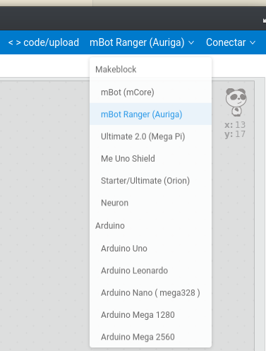
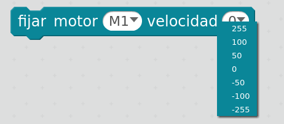
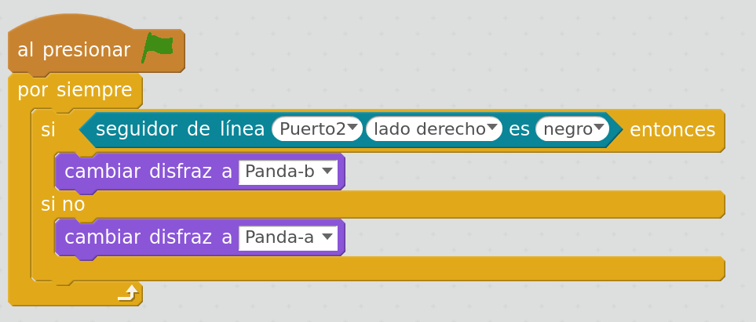
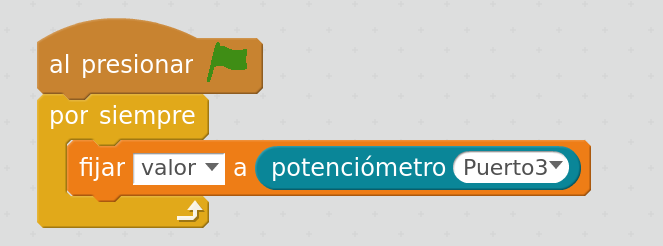
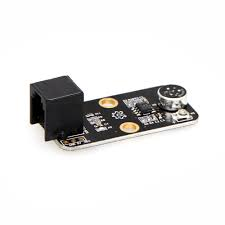

# Clases

## Requisitos

Se recomienda que tengo algo de conocimiento de **Scratch**. Se incluye un apéndice con un repaso rápido.

## 0. Introducción a la robótica. ¿Qué es un robot? 

Duración 20-30 minutos

Dinámica. Trabajo en grupo. Preguntas en alto para responder

* ¿Conoces algún robot?
* ¿Dónde lo has visto?
* ¿Tienes alguno en casa?

A quien responda
* ¿Qué hace?
* ¿Qué partes tienes?


### Tips
* Distinguir Robot de autómata o de herramienta
* Aprovechar las descripciones que hacen para ir dando conceptos
* Se puede hablar de:
    * Robot de limpieza: 2 ruedas/motores, sensores de choque, de paredes, detectores de suelo, motor del aspirador ¿Saben buscar su casita?
    * Robot de cocina: diferenciar de las "herramientas eléctricas de cocina". Motor/batidora, báscula, calentador,...
    * Parking automático: barreras, cámaras lectoras de matrícula, sensores de ocupación, pantallas, cajeros, sensores de humos, ventilación... 
    * ¿Un coche es un robot? ¿y uno que conduce él solo? (Ejemplos de Tesla)
    
### Conceptos a buscar
* Sensores: tipos y lo que miden
* Actuadores: motores + mecánica
* Cerebro: tipo de placas de control. Comparación de capacidades entre Arduino y un móvil
* Alimentación: baterías, paneles solares,...


# Definición de robot:

"Máquina automática programable capaz de realizar determinadas operaciones de manera autónoma y sustituir a los seres humanos en algunas tareas, en especial las pesadas, repetitivas o peligrosas; puede estar dotada de sensores, que le permiten adaptarse a nuevas situaciones”

## 1. Montaje

### Reto: Montaje del robot.

Seguiremos las instrucciones de montaje del robot mBot incluídas en su caja.

[Instructions](https://www.robotshop.com/media/files/pdf/mBot-instruction.pdf)

(Pueden hacerlo perfectamente sólos)

mBot es un robot robusto, con una estructura metálica que permite montarlo y desmontarlo varias veces.

Los alumnos que lo montan adquieren un mejor conocimiento del robot.

### Reto: Identificación de los componentes del robot

Ver qué es cada componente e identificarlo.

## 2. Entorno mBlock

mBlock es una adaptación de Scratch que ha hecho la empresa makeBlock para facilitar la programación de sus robots.

Cualquier programa que funcione en Scratch funcionará en mBlock

Existen varias versiones del entono mBlock disponible:
* Versión 4: (disponible para instalar en Gualinex)
* Versión 5: que se ejecuta desde el navegador y que require de la instalación de un complemento, mblock-mlink, no disponible en Guadalinex.

Salvo la instalación el uso es prácticamente el mismo.

### Instalación


#### Versión 4

Desde el "Centro de Software de Guadalinex Edu":

* Buscamos "mBlock"
* Instalamos
* Aparecerá en Aplicaciones->Programación->mBlock


#### Versión v5

Accedemos al ide [https://ide.mblock.cc/#/](https://ide.mblock.cc/#/)

o [descargamos](https://mblock.makeblock.com/en-us/download/)

[Instalación](https://www.mblock.cc/doc/en/old/mlink-quick-start-guide.html)

En linux
```
sudo mblock-mlink start

```


### Uso de mBlock


Las paletas nos permiten seleccionar grupos de bloques, donde se guardan por afinidad

Moveremos los bloques a la parte del programa para ir creando este

Los bloques se ejecutan siempre de arriba a abajo (y han de colgar de un evento)

Si pulsamos en un bloque lo ejecutamos aunque no forme parte del programa

Si se realizan movimientos del objeto o dibujos esto se harán sobre el lienzo


### Funcionamiento

Tenemos 2 modos de funcionamiento:

#### Scratch/mBlock

Podemos usar todos los bloques disponibles con lo que nuestro programa se ejecuta en el pc (actuando sobre los objetos) y en el robot (con todas las acciones que realizamos sobre este)

Nuestro acciones que enviamos al robot se interpretan sobre un **firmware base** que tenemos que tener instalado en este

## Instalacion del Firmware

Ha de hacerse vía USB

* Conectamos el robot al PC
* Seleccionamos nuestro robot mBot Core



* Seleccionamos USB


* Pulsamos sobre "Update Firmware"

## 3. Uso de la pantalla, luces y sonido

En esta versión 4 de mBlock, todos los bloques asociados al control del robót están en la paleta robot


### Pantalla leds

Vamos a empezar haciendo dibujos en su pantalla de 16x8 leds, 


* Conectamos la pantalla
* Añadimos el bloque de mostrar dibujo

* Seleccionamos el puerto al que la hemos conectado
* Indicamos el número de la cara que queremos mostrar
* O dibujamos nuestro propio dibujo

* Creamos nuestro dibujo


### Reto: mostrar dibujos en la pantalla
Haz que robot muestre diferentes dibujos en pantalla

### Leds RGB

El robot tiene 2 leds RGB, que puedes configurar para que muestren cualquier color, dándole las intensidades de cada color básico (Red, Green, Blue)

Este es un ejemplo de cómo puedes combinar los colores:


Para ello usaremos el bloque correspondiente


### Reto: cambiar el color de los leds RGB

Cambia el color de los led para que tu robot parezca una ambulacia/coche de bomberos

### Sonido

Podemos hacer que nuestro mBlot reproduzca sonidos usando este bloque:


### Reto: haz que suene tu robot

Busca las notas de alguna canción friki y haz que suene

## 4. Movimientos básicos

Podemos controlar el movimiento de los dos motores M1 y M2 con el siguiente bloque



Valores negativos hacen girar el motor en un sentido y los positivos en el otro. En valor absoluto podemos dar valores de 0 (parado) hasta 255 (máxima velocidad). En la práctica, para valores pequeños el motor no se mueve (el valor concreto depende del nivel de carga de las baterias)

Veamos como hacer un ejemplo sencillo de movimiento en una dirección


[ControlMotores.sb2](./Ejemplos/ControlMotores.sb2)

### Reto: Hacer que se muevan los dos motores en el mismo sentido

### Reto: Hacer un bucle que vaya desde la maxima velocidad en un sentido hasta la máxima en el otro

Dependiendo de la  geometría de robot y de la velocidad de cada motor, el movimiento resultante será uno u otro


(Imagen de "juegos-robótica.es")


### Reto: hacer que el robot haga diferentes tipos de giros

* Haz que gire sobre una de sus ruedas, dejándola parada y moviendo la otra
* Ahora haz que el robot gire sobre su centro, moviendo los dos motores en ¿direcciones contrarias?
* ¿Cuál es más rápido? ¿cuál necesita más espacio?


### Reto: controlar el robot con el teclado

Vamos a hacer un sencillo programa para controlar los movimientos del robot con las teclas de las flechas del teclado del PC


[Interaccion Scratch/MakeBlock](../Ejemplos/ControlManual.sb2)


## 5. Movimientos Calibrados

Ya que hemos conseguido que nuestro robot se mueva, vamos a hacer que haga movimientos precisos, tanto en línea recto como en giros.

Para ello:
* Daremos una orden de movimiento al robot (velocidades para cada motor) 
* Esperaremos un cierto tiempo (es lo que tenemos que calibrar)
* Detenemos los motores.

Algo muy frecuente es que se piensa que si los motores se pararán solos, pasado un tiempo., y esto no es así: **Debemos de dar la orden de que se pare EXPLICITAMENTE**. De lo contrario seguirán con el movimiento que tenían.

### Reto: Realizar movimiento de giro de 90, 180 y 360 grados

* Medir el tiempo necesario para generar esos movimientos
* Comparar los tiempos con distintos robots


### Reto: Calibrar el movimiento en línea recta

Suele ocurrir  los motores no giran con igual velocidad, por ello para conseguir movimientos en línea recta es necesario ajustar las velocidas. 

* Ajustar el movimiento del robot a una línea recta de 1 metro.

### Reto: Realizar un circuito donde el robot haga el siguiente movimiento:
* Avance 1metro en línea recta
* Gire 180º
* Avance 1 metro en línea recta volviendo al punto de partida
* Gire 180º para terminar en la posición original


## 6. Sensores

La placa de mbot incluye algunos sensores y además podemos conectar algunos externos mediantes cables.

Hay conectarlos en el puerto adecuado (dependiendo de color) y seleccionar el número del puerto en nuestro programa.

## Sensor de distancia

Se trata de un sensor de ultrasonidos que nos permite medir la distancia a los obstáculos


El funcionamiento se basa en medir el tiempo que tarda en rebotar la onda ultrasónica que se emite


Obtendremos el valor de la distancia al obstáculo usando el bloque siguiente, donde indicaremos en que puerto lo hemos conectado


### Reto: Midiendo distancias

Vamos a mostrar en la pantalla del robot la distancia a la que está el objeto.
[MedidorDistancias](../Ejemplos/MedidorDistancias.sb2)


Podemos hacer un sencillo programa que muestre el valor de la distancia al obstáculo. Para ello crearemos una variable __distancia__ que mostraremos en pantalla


[ProgramaMedidaDistancia.sb2](../Ejemplos/ProgramaMedidaDistancia.sb2)

### Reto: estudio del comportamiento de los ultrasonidos  con diferentes tipos de objetos

* Dado que las ondas de ultrasonidos no rebotan igual en todos los objetos, se puede ver la diferencia entre usar un cartón, un metal o una tela (como una cortina)

* También se puede comprobar que la forma de los objetos influye, no es lo mismo el rebote que se produce en la cara de una caja de cartón que en una esquina de la misma

* El haz ultrasónico tiene forma cónica, es decir se va ensanchando a media que se aleja. Por eso la sensibilidad es diferente a distintas distancias. También ocurre que puede rebotar en el suelo si el sensor está muy bajo

* Comprobar como distintos robots usando ultrasonidos a la vez pueden engañarse (no distinguen si el haz que le llega es el suyo o el de otro) dando lugar a medidas erróneas

### Otros usos del sensor

Piensa otras utilidades del sensor de distancia:

* Altura de un ascensor
* Nivel de líquido en un depósito
* Sistema de alarma
* ...


### Reto: Sensor de aparcamiento

Vamos a hacer que nuestro robot produzca sonidos más rápidos o agudos a medida que un objeto se acerque

## Sensor Infrarrojo

Se trata de un sensor que es capaz de medir la cantidad de luz que se refleja en un objeto. Usa luz infrarroja que él mismo emite para evitar en la medida que se pueda la influencia de la luz ambiental


Podemos determinar su valor con el siguiente bloque


Veamos un sencillo programa para ver el estado del sensor



[SensorIR.sb2](../Ejemplos/SensorIR.sb2)

## Reto: ver como influye el color de la superficie y la iluminación

Comprobar como diferentes superficies e iluminaciones influyen en el resultado


## Reto: buscar proyectos donde puede user útil este sensores
* Contador de personas que pasan por una puerta
* Como final de carrera
* ¿Serviría con líquidos?

### Reto: No te caigas

Vamos a usar este sensor para ver si hemos llegado al borde la mesa:
* Hacemos un programa sencillo que cambia de color cuando hemos llegado a la mesa
* Una vez que funcione, le añadimos movimiento para que el robot se pare al llegar al borde
* Mejor usar poca velocidad y estar atento

### Reto: Midiendo la luz

Podemos medir la luz ambiente con el sensor incorporado.
Usaremos el bloque


## 7. Definiendo comportamientos/personalidades

Con los diferentes sensores que hemos visto podemos hacer que el robot tenga diferentes comportamientos/personalidades

Crea programas para estos comportamientos

### Reto: robot tímido

Al detectar un obstáculo se aleja (sensor de distancia)

### Reto: robot curioso

Al detectar un obstáculo se acerca (sensor de distancia)

### Reto: busca la luz

Gira y se acerca a la luz

### Reto: maniobra de esquivar objeto

Una prueba típica consiste en esquivar obstáculos que encontramos en nuestra trayectoria

Podemos hacerlo de diferentes maneras según la complejidad del programa que queramos abordar

### Forma sencilla: calibrar los tiempos

Sólo tenemos que hacer los giros necesarios, calibrando el tiempo de cada paso hasta superar el obstáculo y volver a nuestra ruta

 

[EsquivaObstaculo.sb2](./Ejemplos/EsquivaObstaculo.sb2)

#### Mejora: programa capaz de aparcar
Se trata de crear los giros de la maniobra y calibrar los tiempos hasta conseguirlo.

Se puede mejorar haciendo que el robot busque aparcamiento y del tamaño necesario


### Forma más compleja

Una vez que detectamos un obstáculo, vamos girando pibotando y volvemos a mediendo la distancia al obstáculo hasta que veamos que ya no lo detectamos y medimos el giro que hemos hecho (por tiempo)

En ese caso avanzamos y giramos en sentido contrario hasta volver a la línea que traímos y volvemos a la posición recta volviendo a girar.

### Reto: siguelíneas

El siguelíneas es una práctica habitual de robótica en la que queremos un robot siga un trazo dibujado en una superficie

Para ello usaremos uno o varios sensores infrarrojos para determinar lo movimientos del robot


(imagen de Programo Ergo Sum)


## Ejemplo 1 sensor

Determinar el programa para con 1 sensor ser capaces de seguir un circuito sencillo siempre en un mismo sentido 

## Ejemplo 2 sensores

Mejorar el algoritmo para usar 2 sensores

## Ejemplo varios sensores: robot velocistas

[Vídeo robot velocista](https://www.youtube.com/watch?v=Dzj1jcQYHJ8)

[Ejemplo de siguelinea](./Ejemplos/Siguelineas.sb2)
[Ejemplo de siguelinea + control manual](./Ejemplos/Siguelineas_controlManual.sb2)

## 8. Kit STEAM

Existen muchos componentes compatibles que podemos conectar a mbot, vamos a ver algunos.

Recordar que es importante conectarlos en el puerto adecuado (dependiendo de color) y seleccionar el número del puerto en nuestro programa.

## Módulo de 4 dígitos de 7 segmentos

Se trata de un módulo que permite mostrar hasta 4 dígitos usando para ello 7 segmentos (que no son otra cosa que leds)


Su uso es muy sencillo basta con usar el bloque que nos permite mostrar un número y seleccionando el puerto al que lo hemos conectado


### Reto: mostrar una sucesión de números en el display

Usaremos una variable que servirá como contador y cuyo valor iremos incrementando en cada iteración


[Ejemplo contador 7 segmentos](./Ejemplos/ContadorEn7Segmentos.sb2)


#### Mejoras
* Añadir un retardo para facilitar ver los valores

Podemos usar este módulo para visualizar medidas de sensores o cualquier dato que interese al usuario.

También lo podemos usar para depurar nuestros programas, mostrando valores de variables

## Potenciómetro

Un potenciómetro es una resistencia variable cuyo valor podemos controlar girando su espiga. El valor estará comprendido entre 0 y 1023

Podemos medir su valor con el siguiente bloque, indicando dónde lo hemos conectado

Este sensillo programa nos permite ver su valor




[Potenciometro.sb2](./Ejemplos/Potenciometro.sb2)

### Reto: Controlar la velocidad de un motor con un potenciómetro

Mediremos el valor del potenciómetro (entre 0 y 1023) y lo dividimos por 4 para obtener un valor entre 0-255 que son los valores de la velocidad


[VelocidadPotenciometro.sb2](./Ejemplos/VelocidadPotenciometro.sb2)

### Reto: Controlar los niveles de las distintas componentes de un led RGB usando 3 potenciometros

## Sensor de sonido

Se trata de un sensor que mide el volumen de sonido 



Podemos ver el valor del volumen con siguiente bloque, nos devuelve un valor entre 0 y 1023


Un programa sencillo que lo usa


[SensorSonido.sb2](./Ejemplos/SensorSonido.sb2)

Ejemplos/Detector de sonido.sb2

### También podemos usar el micrófono del PC

Ejemplos/ControlVolumen.sb2

## 9. Otros robots/montajes

# Arquitectura robots

Dinámica en grupo (si hay pocos las hacemos todos juntos)

Vamos a trabajar la arquitectura de los robots que conocemos
Entregamos algunos componentes del kit para hagan un prototipo de sus robots
* Deben describir lo que hacen 
* Establecer la funcionalidad de su robot
* Ver los componentes disponibles y si necesitan algunos.


## 10. Control remoto

## Control remoto con mando IR

El mando es un mando normal (podemos usar cualquier mando, solo buscando los códigos)


El receptor IR


Usaremos el mando a distancia IR para controlar el robot y que siga lineas o salga de un laberinto

## Codigos mando

[Uso de mando IR](https://makeblock.es/foro/topic/57/utilizacion-mblok-con-receptor-infrarrojos/1#post-155)

    64 Up
    25 Down
    7 Left
    9 Right
    21 Setup
    69 A
    70 B
    71 C
    68 D
    67 E
    13 F
    22 0
    12 1
    24 2
    94 3
    8 4
    28 5
    90 6
    66 7
    82 8
    74 9


## 11. Programación Arduino

#### Modo Arduino

Dado que la placa base de nuestro robot está basada en Arduino, lo que hacemos es enviar un programa nativo a este, con lo que perdemos la posibilidad de ejecutar acciones sobre el PC. Muchos bloques no se pueden usar al activar el modo Arduino 


Vemos como muchas de las paletas se desactivan y aparece el código Arduino que genera nuestro programar. Si subimos el código al robot no podremos volver a usar el modo "Scratch" hasta que le instalemos el firmware

||Modo Scratch|Modo Arduino|
|---|---|---|
|Programación en el PC| SI|NO|
|Velocidad|Baja|Alta|
|Compatibilidad con Arduino|NO|100%|

### Control remoto desde un móvil

Usaremos la app creada y el m'ovil para controlar el robot
Usaremos botones y el acelerometro

Usamos la app [BlueTerm](https://play.google.com/store/apps/details?id=es.pymasde.blueterm&hl=es) para probar 

### Código

        #include "Makeblock.h"
        #include "Arduino.h"
        #include "SoftwareSerial.h"
        #include "Wire.h"

        MeBluetooth bluetooth(4);  //- Usamos el puerto 4 marcado con azul
        MeDCMotor motorDriver1(M1); //- Un motor conectado en el puerto M1

        void setup()
        {
            bluetooth.begin(9600);
        }

        int velocidad = 100;
        int sentido = 1;	// Sentido de giro 1 o -1

        void loop()
        {
            char inDat;		
            
            if(bluetooth.available())
            {   
                //- caracter recibido por bluetooth convertido a mayúsculas
                inDat = toUpperCase(bluetooth.read());
                
                switch(inDat){
                  case 'L':		//- Izquierda
                    sentido=1;
                    run_motor();
                    break;
                  case 'R':		//- Derecha
                    sentido=-1;
                    run_motor();
                    break;
                  case '0':		//- Parada del motor
                    velocidad=0;
                    run_motor();
                    break;
                  case '1':		//- Velocidad lenta
                    velocidad=100;
                    run_motor();
                    break;
                  case '2':
                    velocidad=200;	//- Velocidad rápida
                    run_motor();
                  break;
                  default:break;
                
                }
            }
        }


        //- Le decimos al motor cómo debe girar en base a la velocidad establecida por bluetooth
        void run_motor(){
          motorDriver1.run( sentido*velocidad); 
        }


[Ejemplo](https://www.makeblock.es/tutoriales/bluetooth_arduino_android/)

## 12. Robots compatibles 

### mClon

[MClon](https://tecnoloxia.org/mclon/) es un proyecto Open source que pretende crear un robot totalmente compatible (y de aspecto muy similar) a un mBot, por supuesto programable desde makeBlock


* [Piezas 3D](https://github.com/mClon/3D)
* [Electrónica](https://github.com/mClon/electronica)

También está disponible en formato de corte láser


[Documentación mClon](https://tecnoloxia.org/mclon)

