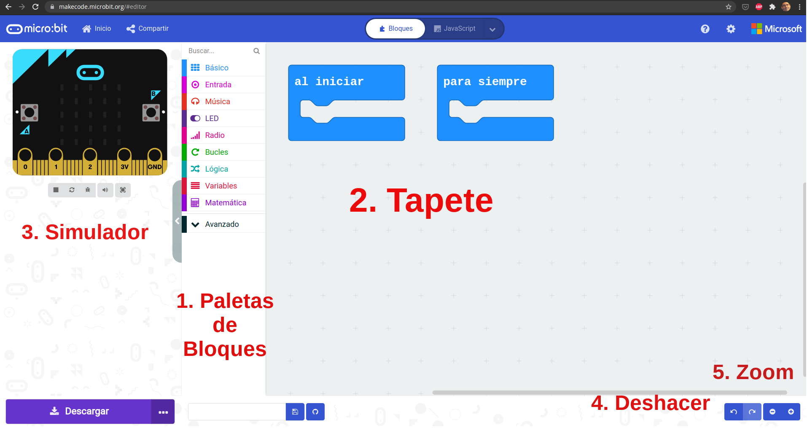
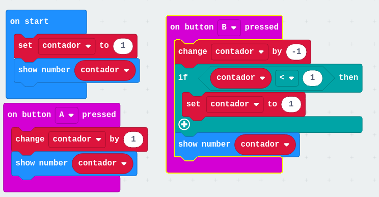

# 0. ¿Qué es un robot? 

Duración 20-30 minutos

Dinámica. Trabajo en grupo. Preguntas en alto para responder

* ¿Conoces algún robot?
* ¿Dónde lo has visto?
* ¿Tienes alguno en casa?

A quien responda
* ¿Qué hace?
* ¿Qué partes tienes?

### Tips
* Distinguir Robot de autómata o de herramienta
* Aprovechar las descripciones que hacen para ir dando conceptos
* Se puede hablar de:
    * Robot de limpieza: 2 ruedas/motores, sensores de choque, de paredes, detectores de suelo, motor del aspirador ¿Saben buscar su casita?
    * Robot de cocina: diferenciar de las "herramientas eléctricas de cocina". Motor/batidora, báscula, calentador,...
    * Parking automático: barreras, cámaras lectoras de matrícula, sensores de ocupación, pantallas, cajeros, sensores de humos, ventilación... 
    * ¿Un coche es un robot? ¿y uno que conduce él solo? (Ejemplos de Tesla)
    
### Conceptos a buscar
* Sensores: tipos y lo que miden
* Actuadores: motores + mecánica
* Cerebro: tipo de placas de control. Comparación de capacidades entre Arduino y un móvil
* Alimentación: baterías, paneles solares,...

# Definición de robot:

"Máquina automática programable capaz de realizar determinadas operaciones de manera autónoma y sustituir a los seres humanos en algunas tareas, en especial las pesadas, repetitivas o peligrosas; puede estar dotada de sensores, que le permiten adaptarse a nuevas situaciones”

# ¿Qué es microbit? Correspondencia con el robot

## ¿Qué es [micro:bit](http://microbit.org)?

micro:bit es un pequeño micro-ordenador programable, diseñado para hacer fáciles y divertidos la enseñanza y aprendizaje de temática #STEAM y totalmente Open Source. Este es su [esquema electrónico](https://tech.microbit.org/hardware/schematic/).

Nos permite trabajar la computación física, haciendo  "tocable"  el pensamiento computacional de una forma sencilla.

Beneficiada de la experiencia de otros muchos sistemas similares anteriores (como Arduino o Raspberry pi) incluye en una pequeña tarjeta una gran cantidad de sensores, leds y botones, permitiéndonos hacer una gran cantidad de proyectos distintos usando sólamente la tarjeta micro:bit

Esta es una breve descripción de su hardware:

1. Botón A y Botón B
1. 5x5 leds rojos
1. Conectores para pinza de cocodrilo P0, P1, P2 (GPIO)
1. Conector 3V (Voltaje)
1. Conector GND (Tierra)

1. Antena de radio y bluetooth
1. Procesador y sensor de temperatura
1. Brújula
1. Acelerómetro
1. Pines (GPIO)
1. Conector microUSB (alimentación y carga de programas)
1. Led de alimentación y/o programación
1. Botón reset
1. Conector de alimentación (2 x pilas 1.5V)
1. Chip USB

### micro:bit V2

[Detalles del Hardware](https://tech.microbit.org/hardware/)

(Tomado de [Overview de microbit.org](https://microbit.org/get-started/user-guide/overview/))

# 1. Emulador: caritas, botones y textos

(Si los alumnos no han programado nunca puede hacer las actividades del Apéndice: Introducción a la programación)

Vamos iniciarnos en la programación con bloques de micro:bit

Podemos programarla usando bloques con el editor **[MakeCode](https://makecode.microbit.org)**

o **[Scratch](https://scratch.mit.edu/microbit)** con la extensión micro:bit

O con lenguajes de programación como **[Python](https://python.microbit.org/v/2)**, Javascript,  e incluso con el C++ de Arduino. Estos son entornos mas avanzados.

Trabajar con Scratch permite mezclar parte de la funcionalidad de nuestra micro:bit (botones, leds, acelerómetro y conexión a los pines 0,1 y 2) con el resto de posibilidades de Scratch: personajes, sonidos, dibujar en pantalla, vídeo, música,... usándola como un mando remoto de nuestro ordenador. Perdemos algunas de las características de micro:bit como la brújula y el sensor de temperatura pero ganamos en interacción.

Para usar toda la funcionalidad de micro:bit debemos usar el editor de bloques de MakeCode o Python. Podemos usar tanto ordenadores como tablets.

Nosotros programaremos nuestra micro:bit con bloques usando el editor de  [Makecode](https://makecode.microbit.org)

## IDE/Entorno de programación

1. Paletas con los bloques de programación. Las paletas tienen un color determinado, igual que los bloques que contienen.
2. Tapete/Lienzo: donde arrastramos los bloques de nuestro programa
3. Simulador: va ejecutando el programa que hemos hecho
4. Botón deshacer
5. Botones de Zoom para ampliar/achicar
6. Configuración. Podemos seleccionar el idioma
7. Nombre de nuestro programa

Si no te aparece en tu idioma, puedes cambiarlo pulsando el icono del engranaje arriba a la derecha y seleccionar el idioma que prefieras

## Reto: Mostrar iconos con los 5x5 leds

Hemos visto que nuestra micro:bit tiene 25 leds (5x5) en la parte delantera. Vamos a mostrar iconos.

Arrastraremos 2 bloques "Mostrar icono" desde la paleta Básico (1) al Tapete (2) dentro del bloque "para siempre"

Este bloque "Para siempre" hace que los bloques que tiene dentro se repitan continuamente, alternándose los iconos.

Si los hubiéramos añadido a "al iniciar" sólo se realizan una vez.

* **Al iniciar**: ejecuta los bloques que tiene dentro una sola vez cuando encendemos la micro:bit o cuando la reseteamos.
* **Para siempre**: repite continuamente los bloques que tiene dentro.

Podemos encontrar estos bloques en la paleta "Básico"

[Proyecto: iconos](https://makecode.microbit.org/_E3Pe8zJRaXVg)

Damos nombre a nuestro programa "Emoticono" escribiéndolo en la caja del nombre (7)

Veremos como se muestran los iconos en el Simulador (3), una excelente características del entorno, que nos permite aprender a programar y usar la micro:bit antes de tener un dispositivo físico.

## Reto: Ajustar el tiempo que se muestra un icono

En el ejemplo anterior los iconos se muestrar consecutiva y rápidamente. Si queremos que se muestren durante un tiempo determinado, tenemos que incluir una espera entre ellos. 

* Busca un bloque que nos permita realizar la espera 
* Añade uno detrás de cada uno de los bloques "mostrar icono".
* Selecciona el tiempo que se muestra cada uno de ellos.

## Reto: mostrar iconos distintos según el botón que pulsemos

Ahora vamos a hacer que al pulsar cada uno de los botones de la micro:bit se muestre un icono distinto. Como tiene 2 botones (Botón A y Botón B) podemos detectar cuando se pulsen por separado o los dos juntos. Cuando los pulsemos la micro:bit nos avisará por medio de un **Evento**, nosotros decidiremos qué hacer cuando se produzca.

Dentro de la paleta **Entrada** tenemos muchos bloques correspondientes a eventos, entre ellos el correspondiente a **Evento Presionar Botón X** que tiene un desplegable para seleccionar Botón A, B o A+B.

Vemos que este tipo de bloques está pensado para que incluyamos dentro otros bloques, que se ejecutarán como respuesta al evento correspondiente.

Pondremos un bloque para cada uno de los eventos de botones: 
* A y B mostrarán iconos distintos
* A+B borrará la pantalla

**Ayuda**: si te aparece uno de los bloques de eventos de color gris es porque ya has seleccionado ese mismo evento/botón. Cámbialo y se mostrará azul.

Puedes eliminar los bloques "al iniciar" y "para siempre" puesto que no los vamos a usar (y siempre podemos encontrarlos en la paleta **Básico**). Para ello arrástralos sobre la paleta de bloques.

[Proyecto botones+iconos](https://makecode.microbit.org/_eCVCkK9bPCDL)

Para probralo, pulsa los botones del simulador en la pantalla (¡No las teclas A y B de tu teclado!) y comprueba que funciona bien.

## Reto: crea tus propios iconos/dibujos

Usa el bloque de dibujo libre para crear tus propios dibujos/iconos

# 2. micro:bit: Caritas, botones y dado

Vamos a comenzar a usar nuestra micro:bit, para ello vamos a descargar los programas que ya hemos hecho (y que volveremos a ver al abrir la página web de Makecode) a la placa. 

Necesitaremos:
* Placa micro:bit
* Cable USB, de tipo micro-usb
* Portapilas y 2 pilas AAA (para usar la micro:bit sin el PC)

Pasar el programa es muy sencillo puesto que la micro:bit aparece como un USB pendrive al conectarla al PC.

El procedimiento para pasar nuestro programa a la micro:bit es el siguiente:

1. Conectamos la micro:bit por USB (con un cable micro-USB). 
1. Veremos que en el ordenador nos aparece conectado un disco USB llamado "Microbit"
1. Descargamos el programa pulsando el botón "Descargar" de la página web

1. Copiamos el fichero a la unidad llamada Microbit. Tarda unos segundos mientras los que parpadea una luz amarilla/ambar que hay en la parte de atrás de la micro:bit. **Hay que esperar hasta que deje de parpadear**.

En un ordenador con Windows:

En un ordenador con Linux/Guadalinex, al pulsar Descargar:

Seleccionamos "Guardar archivo"

Al conectar la micro:bit nos aparecerá una nueva unidad llamada "MICROBIT"

Pulsamos en Lugares

Seleccionamos Descargas

Copiamos el fichero descargado a la unidad "MICROBIT"

* Cuando instalamos un programa se borra el anterior
* El último programa instalado no se pierde al quitarle la alimentación a la placa.

Para probar, pasaremos los 2 programas que hemos hecho anteriormente.

Podemos alimentar la micro:bit con el cable USB conectada al PC o bien conectándola a un USB-Powerbank. También podemos alimentarla con 2 pilas de 1.5V.

## Reto: Usar la microbit para indicar si nos hemos enterado de la explicación

* Pasamos el programa de "Botones e Iconos" 
* Conectamos las pilas para poder usar la micro:bit sin ordenador.
* Hacemos una pregunta y los alumnos con sus micro:bit nos contestan: ¿Os gusta usar las micro:bit?

## Problemas frecuentes:

A veces nos encontramos con problemas para pasar el programa, porque nuestro PC no detecta a la micro:bit. Algunas de las posibles causas:

* Estamos usando un cable USB de alimentación no de datos. Solución: cambiar por otro cable USB.
* El cable USB está defectuoso. Solución: cambiarlo.
* El puerto USB no da suficiente potencia para alimentar la micro:bit. A veces ocurre con los puertos USB delanteros de los PCs. Solución: conectar a un USB trasero.

## Reto: Hacer un dado

Uno de los sensores que incluye la micro:bit es el acelerómetro que nos permite detectar cuando movemos nuestra placa.

Detectaremos movimiento usando el evento **Si agitado** que está, como todos los sensores, en la paleta

Ahora vamos a mostrar un número en la pantalla, para lo que usaremos el bloque **mostrar número** que está en la paleta **Básico**. Pero queremos que sea un número aleatorio, elegido al azar. ¿En qué paleta tendremos un bloque que nos permita hacer eso? Arriba de las paletas tienes una caja para buscar bloques por su nombre. Escribe "azar" y veras que salen varios bloques. 

Usaremos el bloque "escoger al azar de ..."

Donde podemos seleccionar el rango en el que se encontrará el número (en un dado normal es entre 1 y 6).

Al arrastrar el bloque veremos que se queda gris, además no es cuadrado, como los otros bloques, sino redondeado. Eso es porque es un **bloque de valor** y necesita de un bloque cuadrado donde se use su valor.

Para usaremos el bloque **mostrar número** que está en la paleta Básico

Pondremos el bloque de "elegir número..." en el hueco blanco de "mostrar número"

En el simulador podemos pulsar en la palabra **shake** para simular el movimiento.

Ahora ponemos el valor mínimo y máximo que saldrá en nuestro dado.

Vamos a mostrar al inciar el programa una ayuda al usuario, mostrando en pantalla unas instrucciones. Para ello usaremos el bloque "mostrar cadena" donde añadiremos el texto que queramos mostrar

[Programa dado](https://makecode.microbit.org/_erxD3veibFKp)

### Reto hacer un programa que nos de la nota de un examen

Vamos a cambiar los valores para sirva para calificar aleatoriamente un examen...

**Hack:** Truca tu programa para que siempre apruebes...

## Reto: Haciendo ruído

Vamos a hacer música, usando los bloques de la paleta "Música". 
La placa micro:bit incluye muchos sensores, vamos a usar uno de ellos, el acelerómetro, que detecta cuando la movemos.

Vamos a arrastrar desde la paleta "Entrada" el bloque "si agitado" y dentro el bloque "play melody" desde la paleta "Música"

[Música](https://makecode.microbit.org/_Rsfe6X6vMED1)

Vemos que el simulador nos indica que hace falta conectar unos cascos/altavoces. Si acercamos el ratón al simulador veremos que se mueve la placa ¡Podemos simular que la agitamos! Es un simulador muy completo.
El simulador sonará al mover el ratón sobre la placa.

Ahora descargamos el programa como antes. Si tenemos una micro:bit v2 sonará al agitarla.

La versión 1 de la placa micro:bit no tiene altavoz y no sonará nuestro programa, por ello tenemos que conectar un altavoz, por ejemplo el que trae el [Kit de Iniciación a la electrónica de MonkMakes](http://www.monkmakes.com/mb_kit_es)

Usaremos 3 cables de pinzas cocodrilo para conectar el altavoz/Speaker y la micro:bit. Podemos usar cables de cualquier color, pero es mejor seguir un esquema, conectando:

micro:bit| Speaker | cable
---|---|---
GND | GND |cable negro
3V| 3V | cable rojo
0|IN| cable amarillo

Veremos cómo suena:

[Vídeo: Reproduciendo música al agitar micro:bit](https://youtu.be/VwGuElgN2t8)

# 3. Más sensores de micro:bit : temperatura y luz

Vamos a usar sensores incluídos en la micro:bit: temperatura, luz y sonido.

Estos sensores nos da un valor continuo, es decir que puede variar entre un valor mínimo y otro máximo. Diremos que son sensores **analógicos**. Al contrario de los pulsadores que dan valores discretos, verdadero (pulsado) o falso (no pulsado). Decimos que son sensores **digitales**.

Para leer sus valores usaremos bloques redondeados de la paleta **Entradas**

## Reto: mostrar temperatura actual

Vamos a usar lo que ya sabemos para mostrar el valor de la temperatura al pulsar el botón A

El sensor de temperatura de la micro:bit está dentro de un chip. Si lo tocamos se calentará, y tarda un poco en enfriarse.

Al usar el bloque de temperatura en el emulador nos aparecerá dibujado un termómetro cuya temperatura podemos mover.

## Reto: Sensor de sonido

También disponemos de un sensor de sonido. Vamos a modificar el programa anterior para mostrar el nivel de sonido.

## Sentencias condicionales

Son unas sentencias muy útiles que nos permiten ejecutar unos bloques u otros según sea el resultado de una comparación. Por ejemplo, la comparación para expresar la pregunta "¿Hace calor?" será "¿es la temperatura mayor que 25º?"

La encontramos, con los bloques relacionados, en la paleta **Lógica**.

Vemos que tiene 3 partes:
* La condición, que será un bloque de forma hexagonal (los posibles bloques están debajo)
* El grupo de los bloques que ejecutaremos **SI se cumple la condición**
* El grupo de los bloques que ejecutaremos **SI NO se cumple la condición**

### Reto: ¿Hace calor?

Vamos a hacer que se muestre un icono u otro según la temperatura que se mida:
* Como queremos que se esté siempre midiendo, ponemos nuestros bloques dentro de un "Para siempre"
* Añadimos el bloque condicional
* Añadimos un **operador <**
 sobre el hueco hexagonal del bloque condicional
* Ponemos el bloque "temperatura" en el hueco redondeado de la izquierda del operador
* Ponemos el valor de la temperatura en el hueco redondeado de la derecho del operador, por ejemplo 24
* Añadimos el icono a mostrar si se cumple la comparación
* Añadimos el otro bloque mostrar icono si no se cumple

[Programa termostato](https://makecode.microbit.org/_PLxKj7f40cet)

Lo probamos con el emulador y luego en real.

### Reto: Luz de entrada automática

Modificar el programa anterior para que cuando cambie la luz exterior se enciendan más o menos leds de la pantalla

# 4. Robot: movimientos básicos

Vamos a usar el [robot DaguCat](http://www.dagurobot.com/HC014-microbit-F)

Reto: Identificar los componentes de un robot 

Detalle del robot:

Tiene:

* 2 motores
* Sensor infrarrojo (para detectar calor)
* 2 x Sensores  siguelineas
* Sensor Ultrasónico.
* Leds de colores RGB
* Zumbador
* Emisor y detector infrarrojo.
* Salidas para servos.
* Entradas/salidas analógicas/digitales.

Para programarlo añadiremos nuevos bloques que lo controlen a Makecode, usando lo que se llama una **Extensión**, que es complemento que el fabricante del robot comparte para que podamos incluir sus bloques en el programa.

La extensión de nuestro robot está en la dirección [https://github.com/bjdagurobot/bjdg_microbitCar_en](https://github.com/bjdagurobot/bjdg_microbitCar_en) (He creado una url acortada [https://bit.ly/gatoBot](bit.ly/gatoBot) para que lo copien más fácil)

**CUIDADO con los movimientos que se pueden CAER**

### Reto: moviendo adelante y atrás

[Movientos adelante y atrás](https://makecode.microbit.org/_MLz0vWWh286t)

### Reto: girando

# 5. Robot: precisión en los movimientos. Dibujando cuadrados

### Reto: Repitiendo movimientos

### Reto: Moviendo 0.5m

### Reto: Giro de 90º

### Reto: Dibujando un cuadrado

### Reto: Luces e colores

## Puesta en común

Vamos a mostrar cómo nuestros robots hacen los cuadrados en el suelo

# 6. Robot: personalidad. Sensor siguelíneas (no te caigas) y de distancia (timido/cariñoso)

# 7. STEAM Kit

### Reto: Termostato v1

### Reto: Sistema de riego

# 8. Sensores y domótica

### Reto: realiza los montajes de sistemas domóticos de la documentación del kit

## Reto: Controlando corrientes y potencia externa: interruptor electrónico

Vamos a empezar haciendo un sencillo circuito eléctrico con la bombilla, la pila y algunos cables:

Al conectarlo se encenderá la bombilla.

Ahora vamos a hacer un sencillo interruptor hecho con cables. Sustituiremos el cable verde por 2 cables verdes. 

Cuando juntemos los cables verdes se cerrará el circuito y se encenderá la bombilla.

Ahora vamos a insertar interruptor electrónico, un **Relé/Relay** que podremos controlar desde la programación de la micro:bit.
Conectaremos los 2 cables verdes en la salidas **OUT** de la placa del relé. No importa cuál pongamos en cada una:

El relé nos permite controlar más potencia que lo que puede hacer la micro:bit directamente.

Usaremos 2 cables para conectar el Relé a la micro:bit

micro:bit| Relay| cable
---|---|---
GND | GND |cable negro
1| IN | cable blanco

Vamos a hacer un programa para encender y apagar con los botones A y B. 

* Cuando pulsemos el botón A encenderemos la salida P1 de la micro:bit
* Cuando pulsemos el botón B apagaremos la salida P1 de la micro:bit

Usaremos el bloque "Al pulsar el botón A" de la paleta "Entrada" y "escritura digital pin P1" desde la paleta "Pines" de "Avanzados". Seleccionamos "P1" y ponemos "1" para encender y "0" para apagar:

[Música + Luz](https://makecode.microbit.org/_9cCRiFb7C2ys)

* Descargamos el programa a la placa
* Pulsamos el botón A y se encenderá la bombilla
* Pulsamos el botón B y se apagará

Si queremos controlar un motor/ventilador en lugar de la bombilla, sólo tenemos que sustituir la bombilla por el motor. Al cambiarlo tendremos un ventilador controlado desde un micro:bit.

Podemos invertir el sentido de giro del ventilador, cambiando entre sí los cables del motor.

## Reto: Termosto v2

Un termostato es un aparato que hace algo cuando la temperatura es mayor que un valor y otra cosa cuando sea menor.

Para ello vamos a usar  el bloque "Si ... entonces si no" y el bloque hexagonal "operador  >" ambos de la paleta "Lógica" 

* Ponemos el bloque "Si ... entonces si no" dentro del bloque "para siempre" porque necesitamos que se esté revisando siempre esta condición
* Añadimos el bloque hexagonal "operador >"  en la parte de la condición
* En un lado del operador ponemos el valor de la temperatura, de la paleta "Entrada"
* Ponemos en el otro lado el valor de la temperatura que usaremos, por ejemplo 25.
* En caso de que la temperatura sea mayor encenderemos el ventilador con el bloque "escritura digital pin P1" a 1
* En "si no " apagaremos el ventilador con el bloque "escritura digital pin P1" a 0

[Proyecto: Música, Ventilador y termostato](https://makecode.microbit.org/_DzJHtaPoT4dT)

Para probarlo:

* Descargamos el programa
* Tocamos el sensor de temperatura para calentarlo
* Se encenderá el ventilador
* Apuntamos el ventilador hacia el sensor, para enfriarlo
* El ventilador se apaga

[Vídeo: Ventilador controlado con termostato usando micro:bit](https://youtu.be/9PxjRF-k8-g)

# 9. Comunicaciones - Radio

### Reto: Dado comunitario vía Radio

### Reto: Viendo la temperatura de fuera

# 10. Juegos

### Reto: Piedra, papel o tijera

[Programa: Piedra, papel o tijera](https://makecode.microbit.org/_0Xi5xA7gweK5)

### Reto: ¿Quién tiene mejor pulso?

### Reto: ¿A quién le toca?

[Programa: ¿A quién le toca?](https://makecode.microbit.org/_4paTmUARmDdH)

### Reto: Haciendo ruído

[Haciendo ruído](https://makecode.microbit.org/_DujPH54rq0h2)

